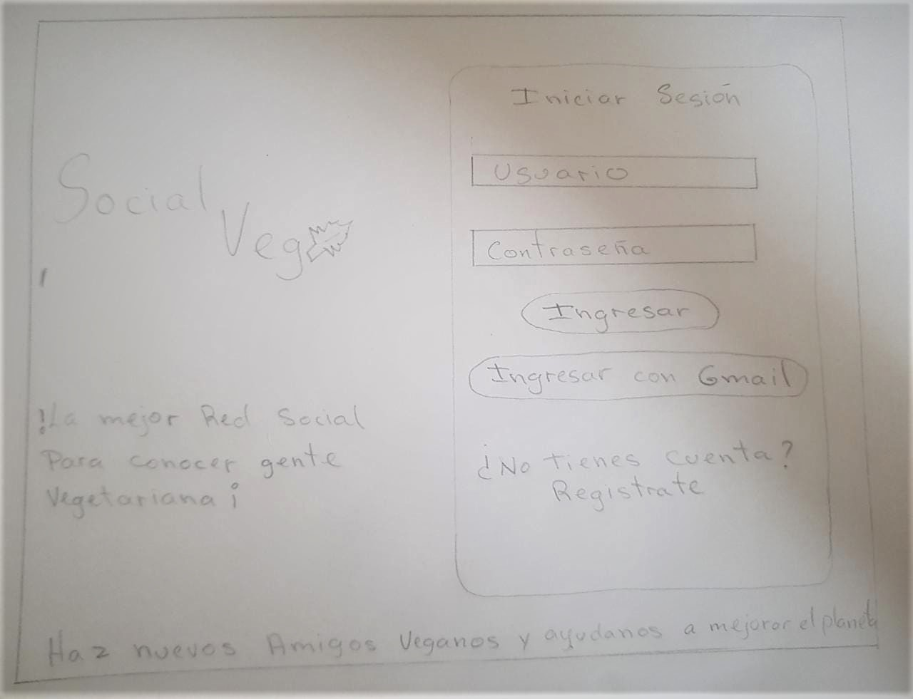

# Social Veg 

## Índice

* [1. Preámbulo](#1-preámbulo)
* [2. Definición del Proyecto](#2-Definición-del-Proyecto)
* [3. Historias de Usuarios](#3-Historias-de-Usuarios)
* [4. Prototipo de baja fidelidad](#4-Prototipo-de-baja-fidelidad)
* [5. Prototipo de alta fidelidad](#5-Prototipo-de-alta-fidelidad)
* [6. Testeo de Usabilidad](#6-Testeo-de-Usabilidad)
* [7. Autores](#7-Autores)

## 1. Preámbulo

Social veg es una red social para vegetarianos en donde  podrás intercambiar y compartir  información, imágenes, recetas, recomendaciones de restaurantes y experiencias personales relacionadas al estilo de vida veg.

## 2. Definición del Proyecto

### 2.1 Perfil de Usuario

Esta red social está enfocada en vegetarianos o personas que están iniciandose en este estilo de vida.

### 2.2 Definición del problema

En el proceso investigativo previo a la creación de esta red social descubrimos que nuestros usuarios presentaban dificultades al relacionarse en un entorno No vegetariano tanto por el cuestionamiento que les hacían sus amigos y familiares por su forma de alimentarse, como por los desafíos que se les presentaban a nivel de salud, insumos y recetas.

### 2.3 Solución del problema

Esta plataforma pretende crear una comunidad de vegetarianos en donde los usuarios puedan compartir noticias, tips, recetas, imágenes, recomendaciones de restaurantes y experiencias personales sobre el estilo de vida Veg.

Cabe destacar que este sitio web “Social Veg” fue implementado utilizando las tecnologías: HTML5, CSS3, JS ECMA6 y la plataforma Firebase de Google. Esta red social le permite a un usuario crear una cuenta de acceso y loguearse con ella, postear en el muro y si lo desea puede editar o borrar sus publicaciones.  Además puede dar “Like” y comentar las publicaciones de otros usuarios.

## 3. Historias de Usuarios

**PRIMERA HISTORIA:**

Yo como: Usuario.

Quiero: registrarme de manera facil y rapida.

Para: formar parte de la red "Social Veg".

CRITERIOS DE ACEPTACIÓN

* El usuario puede visualizar el formulario de registro.
* El usuario puede hacer click sobre el botón ingresar con google( de esta manera se registran sus datos automáticamente).
* En caso de no ingresar con google:
  - El usuario puede ingresar en un input su nombre completo.
  - El input nombre completo no debe contener caracteres numéricos.
  - El usuario puede ingresar en un input su username o nombre de usuario.
  - El usuario puede ingresar en un input su correo electronico.
  - El correo debe contener en sus caracteres “@” y  “.com”.
  - El usuario puede ingresar su contraseña. Este input debe ser secreto.
  - La contraseña debe ser de mínimo 6 caracteres. Y ser alfanumérico.
  - No pueden haber usuarios repetidos.
  - Todos los input son obligatorios y deben contener al menos 1 carácter.
  - El usuario puede hacer click en el botón “registrarme”.Se debe validar que los input estén correctos.
  - En caso que falte un input por llenar o no se cumpla alguno de los criterios anteriores saldrá un mensaje indicando cual es el error.( a) dejo vacío el nombre B) dejo vacio el user name C) menos de 6 caracteres en la contraseña D) no es alfanumérica la contraseña Del correo no cumple con el @ 
  - Se le enviará un correo al usuario para que valide su cuenta.
  - El correo debe decir: Bienvenido (a) a Social Veg.
  - El usuario podrá visualizar la opción: “¿Ya tienes cuenta? Ingresa aquí” para redireccionarlo a la página de iniciar sesión 

**SEGUNDA HISTORIA:**

Yo como: Usuario vegetariano.

Quiero: loguearme de manera facil y rapida.

Para: ingresar a la página ( social Veg).

CRITERIOS DE ACEPTACIÓN

* El usuario podrá visualizar el formulario de iniciar sesión.
* El usuario puede hacer click sobre el botón ingresar con google ingresando de manera automática al muro de social veg.
* El usuario puede ingresar en un input el correo electrónico con el cual se registró.
* El usuario puede ingresar su contraseña. Este input debe ser secreto.
*  El usuario puede hacer click en el botón “ingresar”
Se debe validar que los input estén correctos y si es así redireccionarlo al muro de la página
* En caso que falte un input por llenar o no se cumpla alguno de los criterios anteriores saldrá un mensaje indicando “Tu Contraseña es incorrecta”, "Aun no estas registrado" o "El correo ingresado no cumple con el formato del email".
* Si el usuario no ha verificado su usuario en el correo de verificacion se le informara por medio de un Alert "Por favor confirma tu usuario en el link de verificacion enviado a tu correo"
* El usuario podrá visualizar la opción: “¿No tienes cuenta? Regístrate aquí” para redireccionarlo a la página de registro

**TERCERA HISTORIA:**

Yo como: usuario vegetariano.

Quiero: Publicar y visualizar post. 

Para: intercambiar y compartir información, datos, recomendaciones.

CRITERIOS DE ACEPTACIÓN

- Poder publicar un post.
- Que salga el post publicado en el muro junto con el nombre del autor.
- Que salgan todos los post publicados hasta el momento
- Poder seleccionar un icono en donde se despliegue la opción de Borrar o editar un post. 
- Al dar click en borrar debe aparecer un modal con la confirmación antes de borrar un post.
- El modal debe decir  “¿Estás seguro que quieres eliminar este post?”. Tendrá 2 botones con las opciones “Aceptar” para eliminar el post y la opción “Cancelar” para volver al muro sin borrar el post. 
- Al dar click en la opcion editar un post, debe cambiar el texto por un input que permite editar el texto y luego guardar los cambios.
- Debe tener los botones “Publicar” para guardar y publicar el post editado y “Cancelar” para cerrar el modal sin guardar los cambios.
- Al guardar los cambios debe cambiar de vuelta a un texto normal pero con la información editada.
- Boton cerrar sesión
- Se podrá cerrar la session y redirigir al usuario a la pagina del login.

**CUARTA HISTORIA:**

Yo como: usuario vegetariano.

Quiero:Dar like.

Para: Reaccionar a las publicaciones que me gustan.

CRITERIOS DE ACEPTACIÓN

- Hacer click sobre una imagen de un corazón para dar Like a una publicación.

- Poder dar y quitar like a una publicación. Máximo uno por usuario.

- Llevar un conteo de los likes.

## 4. Prototipo de baja fidelidad.

## 5. Prototipo de alta fidelidad.

[link a figma](https://www.figma.com/file/xJuDtxQNQle9gdX8gSa2sU/Social-Veg-Colors?node-id=0%3A1)

## 6. Testeo de Usabilidad.

[USUARIO 1](https://www.loom.com/share/f1d3b6ef531449ecb11128e5cf9eb857)

[USUARIO 2]()

[USUARIO 3]()

[USUARIO 4]()

## 7. Autores
* Luzciel Montesinos
* Erika Arango 

[link del proyecto Social Veg]()

